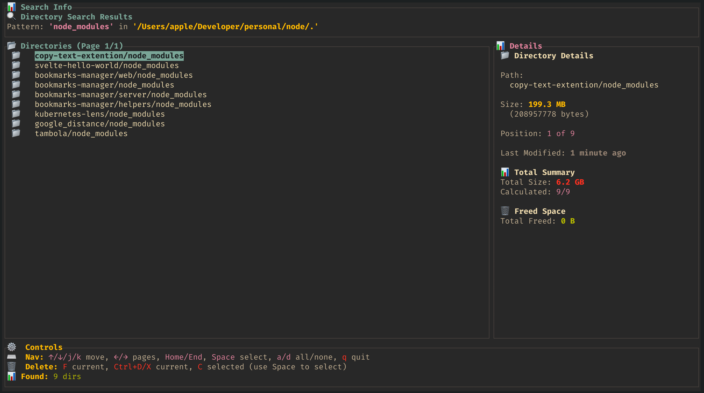

# dir-kill 🗂️

A Rust-based directory management tool that helps you find and manage directories. It provides terminal user interface for discovering directories matching specific patterns.

## What it does

dir-kill scans your file system to find directories that match specified patterns. It's particularly useful for finding and deleting stale project directories like `node_modules`, `target`, `dist`, and other build artifacts to help clean up disk space.



## CLI Usage

### Basic Commands

```bash
# Find all node_modules directories
dir-kill ls <pattern>
```

### Command Options

```bash
dir-kill ls <pattern> [OPTIONS]

OPTIONS:
    -i, --ignore-case      Case-insensitive pattern matching
    -h, --help             Show help information
```

### Examples

```bash
# Find node_modules directories
dir-kill ls node_modules
```

## Installation

```bash
# Clone and build
git clone https://github.com/saiumesh535/dir-kill.git
cd dir-kill
cargo build --release

# Run directly
cargo run -- ls node_modules
``` 