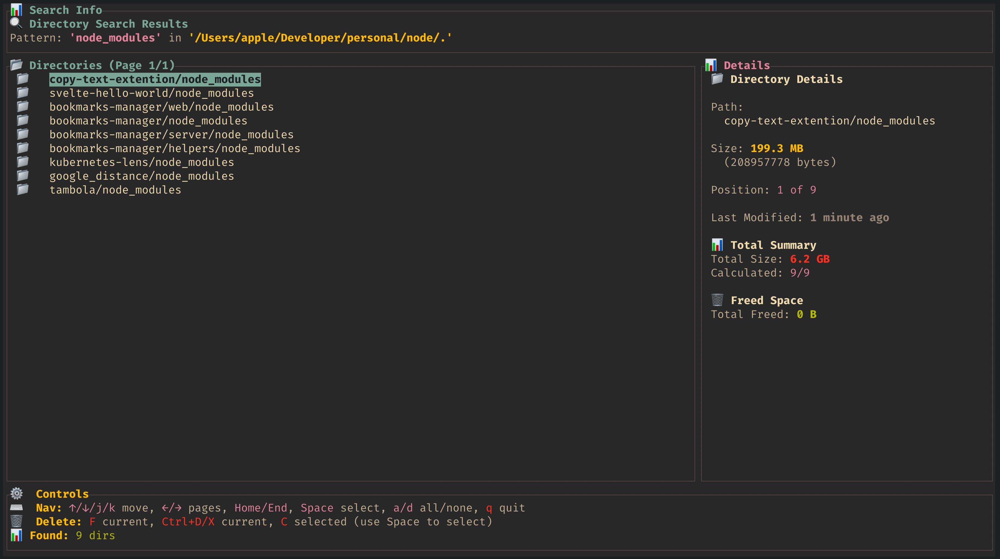

# dir-kill 🗂️

A Rust-based directory management tool that helps you find and manage directories. It provides terminal user interface for discovering directories matching specific patterns.

## What it does

dir-kill scans your file system to find directories that match specified patterns. It's particularly useful for finding and deleting stale project directories like `node_modules`, `target`, `dist`, and other build artifacts to help clean up disk space.



## TUI keyboard shortcuts

When the terminal UI is active, use these keys:

| Key | Action |
|-----|--------|
| `↑` / `↓` or `j` / `k` | Move selection |
| `Home` / `End` | First / last item |
| `←` / `→` | Previous / next page |
| `Space` | Toggle selection on current row |
| `a` | Select all visible matches |
| `d` | Deselect all |
| `s` / `p` / `m` | Sort by size / path / age (toggle asc/desc) |
| `/` | Filter paths (Enter to apply, Esc to cancel) |
| `i` or `Tab` | Toggle details panel |
| `o` | Open selected path in file manager |
| `Ctrl+Y` | Copy selected path to clipboard |
| `Del`, `f`, or `Ctrl+D` | Delete current directory (confirmation) |
| `c` or `Ctrl+Shift+D` | Delete selected directories (confirmation) |
| `Esc` | Close details panel, clear filter, or quit |
| `q` | Quit |

The status bar shows discovery progress, sizing progress (`[████░░░░] sizing N/M`), active filters, sort order, and brief toasts after deletes.

### Preferences

dir-kill saves UI preferences to `~/.config/dir-kill/config.toml`:

- Default sort column and direction
- Details panel visibility
- Whether to auto-sort by size (desc) once all sizes are calculated

## CLI Usage

### Basic Commands

```bash
# Find all node_modules directories (interactive TUI)
dir-kill ls <pattern> <path-directory (default: .)>

# Plain text output (no TUI)
dir-kill ls node_modules --no-tui

# JSON output for scripts
dir-kill ls node_modules --json
```

### Command Options

```bash
dir-kill ls <pattern> [OPTIONS]

OPTIONS:
    -h, --help             Show help information
    -i, --ignore <PATTERNS>    Comma-separated regex patterns for directories to ignore
    --no-tui               Print plain text results instead of launching the TUI
    --json                 Output results as JSON (implies --no-tui)
```

### Examples

```bash
# Find node_modules directories
dir-kill ls node_modules

# Find node_modules directories but ignore .git and temp directories
dir-kill ls node_modules --ignore "\.git,temp"

# Find target directories but ignore specific project directories
dir-kill ls target --ignore "important-project,\.cargo"

# Find dist directories with multiple ignore patterns
dir-kill ls dist -i "node_modules,\.git,backup"
```

### Nested Pattern Avoidance

dir-kill automatically avoids nested pattern matches to prevent infinite recursion and redundant results. For example:

- When searching for `node_modules`, it won't scan inside existing `node_modules` directories
- When searching for `dist`, it won't scan inside existing `dist` directories  
- When searching for `target`, it won't scan inside existing `target` directories
- `.git` directories are skipped during scans (unless you are explicitly searching for `.git`)

This behavior:
- **Prevents infinite recursion** in deeply nested directory structures
- **Improves performance** by avoiding redundant scanning
- **Reduces noise** in results by focusing on top-level matches
- **Works automatically** for any pattern you search for

**Examples:**
```bash
# Will find /project/node_modules but skip /project/node_modules/some-package/node_modules
dir-kill ls node_modules

# Will find /project/dist but skip /project/dist/build/dist  
dir-kill ls dist

# Will find /project/target but skip /project/target/debug/target
dir-kill ls target
```

## Installation

### From Source

```bash
# Clone and build
git clone https://github.com/saiumesh535/dir-kill.git
cd dir-kill
cargo build --release

# Run directly
cargo run -- ls node_modules
```

### From release

1. Download the latest release from [here](https://github.com/saiumesh535/dir-kill/releases)
2. chmod +x dir-kill
3. mv dir-kill /usr/local/bin/dir-kill


```bash
dir-kill ls node_modules
```